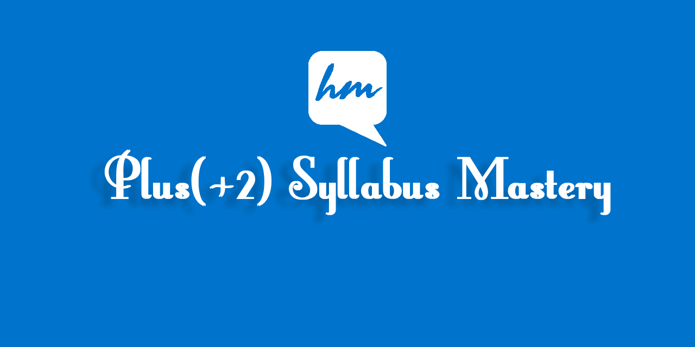

# 📚 Plus(+2) Syllabus Mastery:

🚀 Elevate your learning with Plus(+2) Syllabus Mastery! Explore detailed resources for Class 11 subjects - Compulsory English, Accountancy, Economics, and more. Sharpen your skills for exam success. 📚💡 #Class11Success #ExamPrep #EffectiveLearning

## Introduction

Studying for Plus Two exams can be challenging, and having access to high-quality study materials can make a significant difference. The "Plus(+2) Syllabus Mastery" project is designed to be a one-stop repository for students to find notes, sample papers, and resources to enhance their understanding of various subjects.

## Features

-  Comprehensive study materials for Science, Commerce, and Arts streams.
-  Subject-wise categorization for easy navigation.
-  Regularly updated content to align with the latest syllabus.
-  Contributions from students and educators to ensure diverse perspectives.

## Class 11 Subjects

1. [ Compulsory English :](https://github.com/HimalayaMinds/English-11)
2. [ Nepali :](https://github.com)
3. [Accountancy :](https://github.com/HimalayaMinds/Account-11)
4. [ Business Studies :](https://github.com)
5. [ Economics :](https://github.com/HimalayaMinds/Economics-11)
6. [ Computer Science :](https://github.com)
7. [ Mathematics :](https://github.com)
8. [ Optional Subject :](https://github.com)
